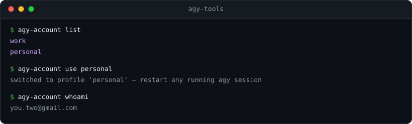

# agy-tools


`agy-account` — log into several **Antigravity CLI** (`agy`, Google's Gemini
coding agent) accounts once, then switch between them with a single command, no
browser re-login. **macOS** only.



It is read-only against your macOS keychain except for the explicit `save` /
`use` / `rm` / `logout` actions. No secrets are stored in this repo.

---

## Why

`agy` keeps exactly one login at a time, stored as an OAuth token in the macOS
login keychain. If you have more than one account (e.g. two Google AI Ultra
subscriptions) the only built-in way to switch is to log out and re-authenticate
in the browser every time.

`agy-account` snapshots each account's token under its own name and swaps them in
place, so switching is instant.

---

## Requirements

- **macOS** (uses the `security` keychain CLI — not portable to Linux/Windows)
- The **Antigravity CLI** installed and logged in at least once (`agy`)
- **Python 3** — only for `logout --revoke` (standard library, no `pip install`)

---

## Install

### Homebrew (recommended)

```bash
brew install tnduyh5/tap/agy-tools
```

### From source

```bash
git clone https://github.com/tnduyh5/agy-tools.git
cd agy-tools
# put the command on your PATH (adjust the target dir to taste)
ln -sf "$PWD"/bin/agy-account ~/.local/bin/
```

Make sure `~/.local/bin` is on your `PATH` (it already is if `agy` lives there).
Installing from source with a symlink means edits to the repo take effect
immediately, which is handy if you want to tweak the script.

---

## `agy-account` — switch accounts

```
agy-account save <name>   snapshot the CURRENT login as profile <name>
agy-account use <name>    switch the live login to profile <name>
agy-account list          list saved profiles
agy-account rm <name>     delete a saved profile from the keychain
agy-account whoami        show the email agy last authenticated as
agy-account logout        drop the LOCAL token only (next `agy` run opens browser login)
agy-account logout --revoke   also revoke the refresh token at Google
```

`logout` is local-only: it removes this machine's copy of the token, but the
grant stays valid at Google and any profile snapshot of it keeps working. Use
`logout --revoke` to kill the grant itself — that also invalidates every saved
profile sharing it, so re-save them after logging in again.

### First-time setup (two accounts)

```bash
# 1. You are already logged into account A. Save it:
agy-account save work

# 2. Drop the live token and log into account B in the browser:
agy-account logout
agy            # complete the browser login for account B
agy-account save personal
```

### Everyday use

```bash
agy-account use work       # instant switch, no browser
agy-account use personal
agy-account whoami         # who am I right now?
agy-account list           # what have I saved?
```

Notes:

- Every `use` first snapshots the currently-live token into a profile named
  `_last`, so a login you forgot to `save` is never lost.
- `agy` reads its token **at startup**. If an `agy` session is already running,
  restart it after switching. Avoid switching while a background `agy` job is
  running — the running session keeps the old token and you can mix up quota
  between accounts.

---

## How it works

- **Token storage.** `agy` stores its OAuth token in the macOS login keychain at
  `service=gemini`, `account=antigravity`. `agy-account` copies that blob to/from
  per-name entries under `service=gemini-profile`. Switching accounts is just
  overwriting the live entry — nothing is sent anywhere.

- **Tokens never touch the command line.** A blob is handed to `security` over
  stdin, not as an argument, because a command line is readable via `ps` by any
  process of the same user — which would sidestep the keychain prompt that
  guards it.

- **Nothing leaves the machine except an explicit revoke.** `logout --revoke` is
  the only action that makes a network call (to Google's OAuth revoke endpoint).

### Why there is no `agy-usage`

An earlier version shipped a second command that tried to report remaining model
quota per account. It was removed because the number could not be trusted: `agy`
itself never calls a quota endpoint, the richer `retrieveUserQuotaSummary` in its
binary returns 403 for normal accounts, and the reachable
`v1internal:retrieveUserQuota` reports every bucket at 100% even after heavy use,
with a `resetTime` of exactly `now + 24h` on every call. A quota display that
always reads "100%" is worse than none.

---

## Caveats

- **macOS only.** Everything hangs off the `security` keychain CLI.
- Reading a keychain secret may prompt for keychain access the first time,
  depending on your setup. Allow the `security` tool and it won't ask again.
- `agy-account` is unofficial and depends on `agy`'s current keychain layout.
  A future `agy` release could change it and break the tool.

---

## Disclaimer

Unofficial, not affiliated with Google or the Antigravity team. Use it only with
your **own** accounts and within the applicable Terms of Service. It moves your
own tokens around your own machine — nothing more.

## License

MIT — see [LICENSE](LICENSE).
